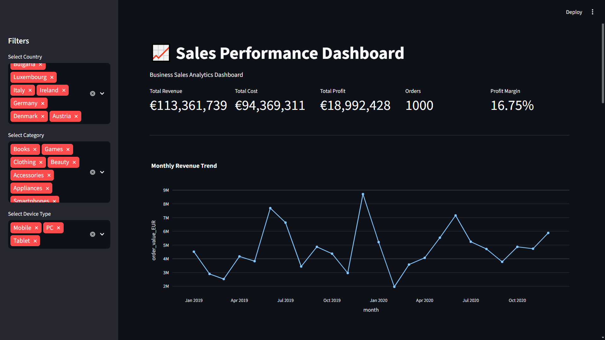
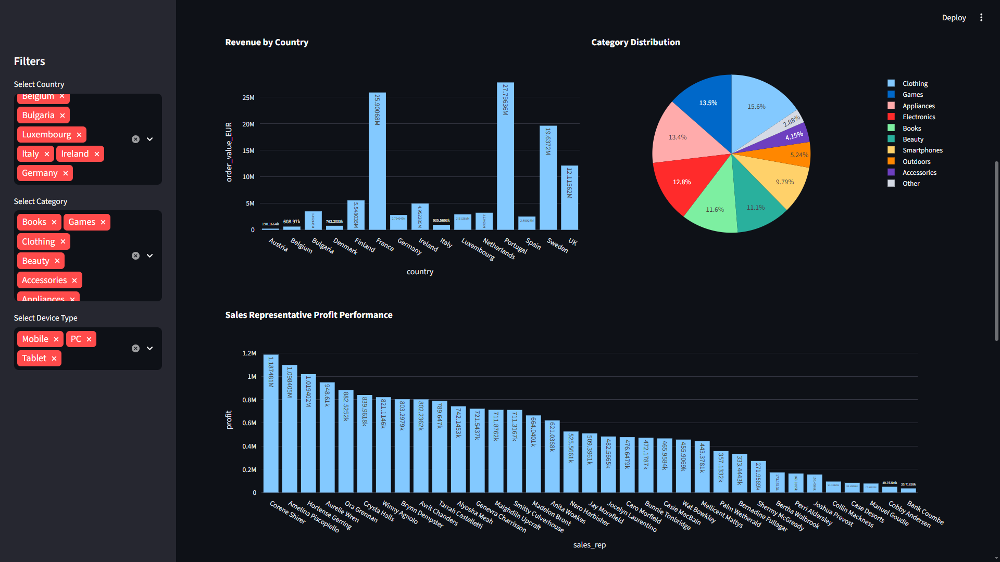
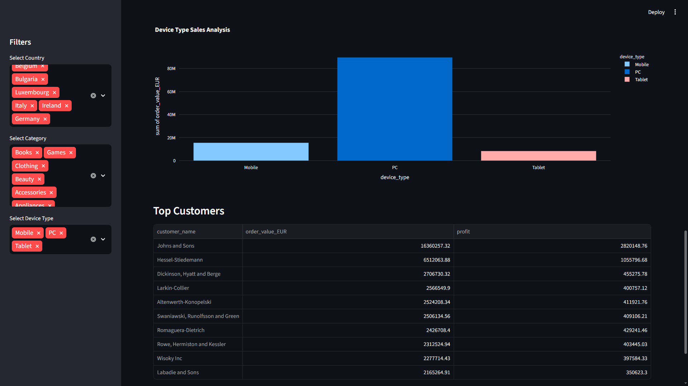

# 📊 Sales Performance Dashboard

An interactive Sales Performance Dashboard built using Python, Streamlit, Pandas, and Plotly for analyzing business sales data in real time.

This project helps businesses monitor revenue, profit, sales trends, customer performance, regional analytics, and product category insights through dynamic visualizations and KPI tracking.

---

# 📈 Dashboard Preview

## Main Dashboard



## Sales Trend Analysis



## Country-wise Performance




---

# 🚀 Features

- Interactive Dashboard UI
- Revenue, Profit & Order KPIs
- Monthly Sales Trend Analysis
- Country-wise Revenue Analysis
- Product Category Distribution
- Sales Representative Performance Tracking
- Device Type Analysis
- Top Customers Table
- Real-time Sidebar Filters
- Raw Data Viewer

---

# 🛠 Technologies Used

- Python
- Streamlit
- Pandas
- Plotly

---

# 📂 Project Structure

```text
Sales-Performance-Dashboard/
│
├── app.py
├── requirements.txt
├── README.md
└── Sales-Export_2019-2020(1).csv
